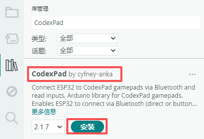
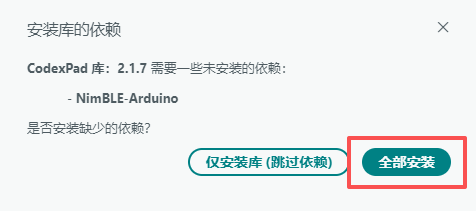

# CodexPad Arduino Lib

[中文](README.zh-CN.md)

## Overview

This library is an Arduino library for **CodexPad** series gamepads, enabling ESP32 series development boards to connect via Bluetooth and read all button and joystick input states from the gamepad. For detailed information about the gamepad products, please refer to the following product documentation.

| CodexPad Model | Details |
| :--- | :--- |
| CodexPad-C10 | [Product Details](../../../codex_pad_c10/blob/main/README.md#codexpad-c10) |
| CodexPad-S10 | [Product Details](../../../codex_pad_s10/blob/main/README.md#codexpad-s10) |

## Supported Hardware Platforms

| Supported Hardware Platforms |
| :--- |
| ESP32 |
| ESP32-S3 |
| ESP32-C3 |
| ESP32-C5 |
| ESP32-C6 |
| ESP32-H2 |

## Features

- **Flexible Dual-Mode Connection**:
  - **Direct Connection by Address**: Quickly establish a stable connection with a specific gamepad using its known address.
  - **Button Mask Connection**: No need to know the address in advance. Scan and match a user-defined button combination (i.e., "button mask") held on the target gamepad, then automatically connect to the device with the strongest signal (maximum RSSI) for fast and flexible pairing.
- **Real-time Button Event Detection**: Read the input status of all buttons in real time, distinguishing between **press**, **release**, and **hold** events.
- **High-Precision Joystick Data**: Obtain analog values for the X and Y axes of the left and right joysticks, ranging from 0 to 255, providing precise control input.

## Usage Instructions

### Preparation

Before starting programming, complete the following preparation steps to ensure a smooth development process.

#### Familiarize Yourself with the Product Documentation

- Read the gamepad product manual thoroughly to fully understand the hardware features, familiarize yourself with the button and joystick layout, function definitions, LED indicator status, and power on/off operations.

#### Obtain and Record the Gamepad Address

> **⚠️ Important Note**: The direct connection examples in this library connect via address. **When programming, you must explicitly specify your gamepad's address in the code.**

Refer to the method provided in the product manual to obtain your gamepad's address. Its format is typically `"E4:66:E5:A2:24:5D"` (composed of characters 0-9, A-F, with a half-width colon). Please record this information properly, as you will need to replace it with the actual address of your own gamepad in the code later.

#### Power On the Gamepad and Enter the Connectable State

- Turn on the gamepad. After powering on, it will automatically enter a Bluetooth discoverable **connectable state**, and the LED indicator should blink **slowly (about once per second)**.

### Install ESP32 Board Manager

1. In Arduino IDE, open **Tools** > **Board** > **Boards Manager...**.
2. In the search box, type `esp32`, find and install **ESP32 by Espressif Systems**.
3. After installation, select the specific ESP32 board model you are using (e.g., `ESP32 Dev Module`) from the **Tools** > **Board** list.
4. Connect the board to your computer via a USB cable, and select the correct serial port from the **Tools** > **Port** menu.

### Install the CodexPad Library

1. **Open Arduino IDE Library Manager**
   - Menu: **Tools** → **Manage Libraries...**
   - Shortcut: `Ctrl+Shift+I` (Windows/Linux) or `Cmd+Shift+I` (Mac)
2. **Search and Install**
   - In the search box, type: `CodexPad`
   - Find the CodexPad library
   - **Make sure to select the latest version from the dropdown menu**
   - Click the **Install** button

   

   > **📌 Note:** The screenshot is for reference only. Be sure to install the latest available version.
3. **Install Dependencies**
   - When the dependency installation dialog appears, select **Install All**

   

> **⚠️ Important Version Note**  
> The screenshots in this document may show older versions. **Always install the latest versions of the following:**
>
> - `CodexPad` library
> - `NimBLE-Arduino` dependency
> - `GamepadInput` dependency
> - `cyfney-cpp` dependency
>
> If you skipped the dependency installation, manually install the latest versions of `NimBLE-Arduino`, `GamepadInput`, and `cyfney-cpp` libraries:
>
> 1. Open the Library Manager again
> 2. Search for `NimBLE-Arduino`, `GamepadInput`, or `cyfney-cpp`
> 3. **Select the latest version** from the dropdown menu
> 4. Click Install

## Example Descriptions

### Basic Polling Example (`basic_polling`)

- **Example Location**: In Arduino IDE, go to **File** → **Examples** → **CodexPad** → **basic_polling** to find this example.
- **Description**: Connect to a CodexPad via the Bluetooth device address, poll and print all button states and joystick values in real time.

### Input State Detection Example (`inputs_detection`)

- **Example Location**: In Arduino IDE, go to **File** → **Examples** → **CodexPad** → **inputs_detection** to find this example.
- **Description**: Connect to a CodexPad via the Bluetooth device address, detect changes in button states and joystick values, and print them.

### Button Mask Connection Example (`button_mask_connection`)

- **Example Location**: In Arduino IDE, go to **File** → **Examples** → **CodexPad** → **button_mask_connection** to find this example.
- **Operation Steps**: After the code starts, it enters scanning and connection mode. When the gamepad is powered on, its blue LED blinks. At this point, hold the button mask (button combination) specified in your code on the gamepad (default is `Start` + `Cross(A)`) until the host connects to it. Then operate the gamepad normally and observe the log output in the console.

## Button Mask Connection Explained

Details: [Button Mask Connection Explained](../../../codex_pad_guide/blob/main/button_mask_connection_explained.md#button-mask-connection-explained)

## Safety Tips

### Real-time Connection Status Detection

💡 **It is recommended to continuously call `is_connected()` in the main loop to monitor the gamepad connection status in real time.**

When a disconnection is detected (e.g., gamepad powered off, out of range, or Bluetooth interference), **be sure to immediately stop the controlled device** (e.g., brake a car, lock a robotic arm, etc.).

Due to optimizations in disconnection detection delay in this update, the system can detect connection loss faster. If not handled promptly, moving devices such as cars or robots may remain in their previous state due to not receiving new control commands, leading to loss of control and potential safety hazards.

## API Documentation

Details: <https://codexpad.github.io/codex_pad_arduino_lib/html/annotated.html>

## License

This project is licensed under the MIT License - see the [LICENSE](LICENSE) file for details.
